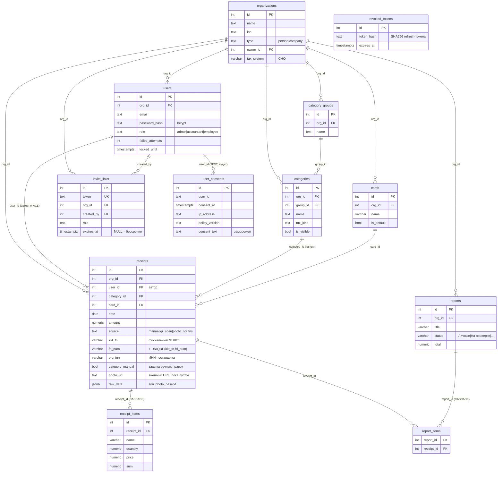
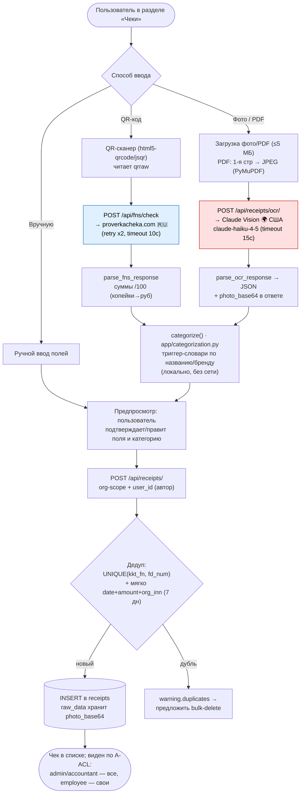

# AOCG AI Офис — структурная карта (по факту из кода)

> Карта построена **по фактическому коду** двух репозиториев на 2026-06-29:
> `aocg-ai-office` (бэкенд, FastAPI) и `aocg-ai-office-web` (фронтенд, React).
> Где функциональность из ТЗ ещё не написана — это помечено стилем
> **«план / не реализовано»**, а не нарисовано как существующее.
>
> Метод: четыре параллельных read-only обхода (роутеры/безопасность,
> схема БД/фото, внешние API/инфра, фронтенд). Ничего не менялось.

---

## 1. Общая карта связей (слои)

```mermaid
flowchart TB
    %% ============ ФРОНТЕНД ============
    subgraph FE["ФРОНТЕНД · aocg-ai-office-web · React 19 + Vite · server.js :4173"]
        direction TB
        subgraph FEFIN["Приложение «Финансы» (active) — App.jsx (монолит ~10.4k строк)"]
            FE_Home["Главная / дашборд<br/>pages/GlavnayaPage.jsx"]
            FE_Checks["Раздел «Чеки» (Operacii)<br/>список + QR-сканер + загрузка фото/OCR"]
            FE_Svodka["Раздел «Сводка»<br/>аналитика, НДС, графики"]
            FE_Reports["Раздел «Отчёты»<br/>Личные/На проверке/Одобрены/Отклонены"]
        end
        FE_Auth["Вход / Регистрация<br/>Login · Register · VerifyEmail · Join"]
        FE_Consent["Согласие 152-ФЗ<br/>ConsentScreen (2 чекбокса)"]
        FE_Settings["Настройки<br/>аккаунт · организация · пользователи/роли ·<br/>категории · карты · сервисы · приглашения"]
        FE_API["API-слой: authFetch (App.jsx:119)<br/>Bearer JWT + авто-refresh на 401<br/>base = VITE_API_URL"]

        subgraph FEPLAN["План / НЕ реализовано (только названия в меню)"]
            FE_Prima["Приложение «Прима»:<br/>Авансовые отчёты · Акты · Счета"]
            FE_FinMod["Модули Финансов:<br/>ДДС · ОПУ · Бюджет"]
        end
    end

    FE_Home --> FE_API
    FE_Checks --> FE_API
    FE_Svodka --> FE_API
    FE_Reports --> FE_API
    FE_Auth --> FE_API
    FE_Consent --> FE_API
    FE_Settings --> FE_API

    %% ============ БЭКЕНД ============
    subgraph BE["БЭКЕНД · aocg-ai-office · FastAPI · Railway (Procfile uvicorn :$PORT)"]
        direction TB
        BE_MW["AOCGSecurityMiddleware<br/>rate-limit · IP-бан · HTTPS · security-headers"]
        BE_CORS["CORS whitelist (CORS_ORIGINS)"]
        BE_Auth["auth.py · JWT HS256<br/>access 60м / refresh 30д · bcrypt(12)<br/>lockout 5 попыток / 15м · revoked_tokens"]
        BE_Sec["пакет aocg_security/<br/>маскирование ПД (ИНН/fn/карты) +<br/>валидация ИНН/карт/сумм"]

        subgraph ROUTERS["app/routers/ (11 доменов)"]
            R_auth["auth · invite · egrul<br/>/api/auth · /api/invite · /api/egrul"]
            R_receipts["receipts · ocr<br/>/api/receipts (+ /ocr/, /bulk-delete)"]
            R_fns["fns · /api/fns/check"]
            R_reports["reports · /api/reports"]
            R_cards["cards · /api/cards"]
            R_cat["categories · /api/categories"]
            R_users["users · /api/users"]
            R_org["organizations · /api/organizations"]
            R_consent["consent · /api/consent"]
            R_services["services · /api/services"]
        end
        BE_Cat["categorization.py<br/>триггер-словари (локально, без сети)"]
    end

    FE_API -->|"HTTPS + Bearer JWT"| BE_CORS --> BE_MW --> ROUTERS
    BE_Auth -. "get_current_user / org-scope" .-> ROUTERS
    BE_Sec -. "маскирование/валидация" .-> BE_MW
    BE_Sec -.-> R_fns
    R_receipts --> BE_Cat
    R_fns --> BE_Cat

    %% ============ ДАННЫЕ ============
    subgraph DATA["ДАННЫЕ · PostgreSQL @ Railway (asyncpg pool, init_db)"]
        DB[("12 таблиц<br/>organizations · users · receipts ·<br/>receipt_items · reports · report_items ·<br/>cards · category_groups · categories ·<br/>invite_links · user_consents · revoked_tokens")]
        PHOTO["Фото чека:<br/>сейчас base64 в receipts.raw_data (JSONB)<br/>поле photo_url есть, но upload НЕ реализован"]
    end

    R_receipts --> DB
    R_reports --> DB
    R_cards --> DB
    R_cat --> DB
    R_users --> DB
    R_org --> DB
    R_consent --> DB
    R_auth --> DB
    R_receipts --> PHOTO

    %% ============ ВНЕШНИЕ СЕРВИСЫ ============
    subgraph EXT["ВНЕШНИЕ СЕРВИСЫ"]
        EX_Claude["Claude Vision · Anthropic<br/>claude-haiku-4-5 · OCR чеков<br/>ANTHROPIC_API_KEY"]
        EX_PCheck["proverkacheka.com<br/>проверка чека по QR · PROVERKACHEKA_TOKEN"]
        EX_Egrul["egrul.nalog.ru<br/>контрагент по ИНН (без ключа)"]
        EX_Resend["Resend · письма верификации/инвайтов<br/>RESEND_API_KEY"]
        EX_Sentry["Sentry · мониторинг ошибок<br/>(ПД маскируются before_send) · SENTRY_DSN"]
        EX_Yoo["ЮКасса / YooKassa · платежи<br/>НЕ подключено (нет кода)"]
        EX_Alfa["Альфа-Банк · только статус в /api/services<br/>интеграции нет"]
    end

    R_receipts -->|"POST /ocr/"| EX_Claude
    R_fns --> EX_PCheck
    R_auth --> EX_Egrul
    R_auth --> EX_Resend
    BE_MW -.-> EX_Sentry

    %% ============ ИНФРА ============
    subgraph INFRA["ИНФРА · Railway (auto-deploy из main) + CI"]
        INF_BE["сервис: backend (FastAPI)"]
        INF_FE["сервис: frontend (server.js)"]
        INF_PG["сервис: PostgreSQL"]
        INF_CI["GitHub Actions · pytest + ruff на push"]
        INF_Yandex["Yandex Object Storage<br/>резидентность фото в РФ · план S-06"]
    end

    INF_BE -. "host" .-> BE_MW
    INF_FE -. "host" .-> FE_API
    INF_PG -. "host" .-> DB
    PHOTO -. "целевое хранилище (S-06)" .-> INF_Yandex

    %% ============ СТИЛИ ============
    classDef transborder fill:#ffe0e0,stroke:#cc0000,stroke-width:2px,color:#000;
    classDef planned fill:#f0f0f0,stroke:#999,stroke-dasharray:5 5,color:#555;
    classDef rf fill:#e0f0ff,stroke:#0066cc,color:#000;

    class EX_Claude,EX_Resend,EX_Sentry transborder;
    class EX_PCheck,EX_Egrul rf;
    class FE_Prima,FE_FinMod,EX_Yoo,EX_Alfa,INF_Yandex planned;
```

### Легенда

| Обозначение | Смысл |
|---|---|
| 🟥 красная заливка | **Трансграничный канал** (ПД покидают РФ): Claude Vision (США), Resend (ЕС), Sentry (ЕС). Требуют согласия субъекта + уведомления РКН (152-ФЗ) |
| 🟦 голубая заливка | Внешний сервис **внутри РФ**: proverkacheka, ЕГРЮЛ |
| ⬜ серый пунктир | **План / не реализовано** в коде на дату карты |
| сплошная стрелка | реальный вызов / связь в коде |
| пунктирная стрелка | сквозная связь (guard, hosting, маскирование, целевое состояние) |

---

## 2. Схема данных (PostgreSQL) — таблицы и связи

Все доменные таблицы привязаны к `organizations.id` через `org_id`
(мультиарендность; org-scope фильтр обязателен во всех запросах).

**Где хранятся фото чеков (по факту):**
- Сейчас — base64 внутри `receipts.raw_data` (JSONB). Отдаётся через
  `GET /api/receipts/{id}/photo` (декод в JPEG).
- Поле `receipts.photo_url` под внешний URL заведено, но **upload не
  реализован** (задача S-06). В коде остался комментарий «Cloudflare R2 etc.» —
  ⚠️ R2 запрещён по 152-ФЗ; целевое хранилище — **Yandex Object Storage** (РФ).

---

## 3. Поток обработки чека: сканирование → OCR/ФНС → категоризация → БД

Фактически есть **три** пути добавления чека, и они сходятся на одном
INSERT с дедупликацией.

---

## 4. Бэкенд — роутеры и эндпоинты (по группам)

Подключение в `app/main.py` (порядок): auth → receipts → reports → fns →
cards → ocr → consent → users → services → categories → organizations.

| Домен / префикс | Ключевые эндпоинты |
|---|---|
| **auth · invite · egrul** (`/api`) | `POST /auth/register`, `GET /auth/verify-email`, `POST /auth/login` (10/мин), `POST /auth/refresh`, `POST /auth/logout`, `GET /auth/me`, `POST /invite/create`, `GET /invite/validate/{t}`, `POST /auth/register-by-invite`, `GET /invite/list`, `DELETE /invite/{t}`, `GET /egrul/{inn}` |
| **receipts** (`/api/receipts`) | `GET /`, `GET /{id}`, `GET /{id}/photo`, `POST /`, `PATCH /{id}`, `DELETE /{id}` (soft, анти-энумерация), `POST /bulk-delete`, `POST /dedupe-cleanup/`, `GET /suggest-payment` |
| **ocr** (`/api/receipts`) | `POST /ocr/` — распознавание фото/PDF через Claude Vision |
| **fns** (`/api/fns`) | `POST /check` — проверка чека по QR через proverkacheka |
| **reports** (`/api/reports`) | `GET /`, `POST /` (IDOR-проверка receiptIds), `PATCH /{id}` |
| **cards** (`/api/cards`) | `GET /`, `POST /`, `PATCH /{id}`, `PATCH /{id}/default`, `DELETE /{id}` |
| **categories** (`/api/categories`) | `GET /`, `POST /` (admin/accountant), `PATCH /{id}`, `DELETE /{id}`, `PATCH /{id}/visibility` |
| **users** (`/api/users`) | `GET /`, `GET /me`, `PATCH /me`, `POST /me/change-password`, `POST /` (admin), `PATCH /{id}`, `DELETE /{id}` |
| **organizations** (`/api/organizations`) | `GET /me`, `PATCH /me` (admin; org_id из токена, без IDOR) |
| **consent** (`/api/consent`) | `POST /` (иммутабельная запись), `GET /{user_id}` |
| **services** (`/api/services`) | `GET /` — статусы интеграций (ФНС, Анропик/OCR, Альфа-Банк) |

**Безопасность (слой):**
- `AOCGSecurityMiddleware` — rate-limit (60/мин общий, 5/мин на `/api/auth/*`),
  авто-бан IP, принудительный HTTPS, security-заголовки.
- `aocg_security/` (внутри бэкенда) — маскирование ПД в логах/Sentry
  (`mask_inn/card/fn`, `mask_log_dict`), валидация ИНН/карт/сумм.
- `auth.py` — JWT HS256 (access 60 мин / refresh 30 дн), bcrypt,
  lockout 5 попыток → 15 мин, `revoked_tokens` (SHA256), защита от
  энумерации логина, fail-fast при отсутствии `JWT_SECRET_KEY`.
- org-scope фильтр (`WHERE org_id = $N`) и ролевой A-ACL
  (`can_see_all` / `can_delete_any`) во всех доменных запросах.

---

## 5. Внешние сервисы и трансграничные каналы (152-ФЗ)

| Сервис | Назначение | env-ключ | Страна | Канал |
|---|---|---|---|---|
| **Claude Vision** (Anthropic) | OCR фото чеков (`claude-haiku-4-5`) | `ANTHROPIC_API_KEY` | 🌍 США | **трансграничный** |
| **Resend** | письма верификации/инвайтов | `RESEND_API_KEY` | 🌍 ЕС | **трансграничный** |
| **Sentry** | мониторинг ошибок (ПД маскируются) | `SENTRY_DSN` | 🌍 ЕС | **трансграничный** |
| **proverkacheka.com** | проверка чека по QR (ФНС) | `PROVERKACHEKA_TOKEN` | 🇷🇺 РФ | внутренний |
| **egrul.nalog.ru** | контрагент по ИНН | — (без ключа) | 🇷🇺 РФ | внутренний |
| ЮКасса / YooKassa | платежи/подписки | — | — | **в коде отсутствует** |
| Альфа-Банк | — | — | — | только строка статуса в `/api/services`, интеграции нет |

> Категоризация, парсинг JSON и валидация ИНН — **локальная логика без сети**.

---

## 6. Инфраструктура и деплой

- **Хостинг:** Railway, auto-deploy из ветки `main`.
  - Бэкенд: `Procfile` → `uvicorn app.main:app --host 0.0.0.0 --port $PORT`.
  - Фронтенд: `server.js` (Express static + SPA-fallback), слушает **порт 4173**
    (хардкод, не `$PORT`), запуск `npm run start`; сборка `vite build` → `dist/`.
  - PostgreSQL: отдельный сервис Railway, строка `DATABASE_URL`.
- **CI:** GitHub Actions на каждый push/PR — `pytest tests/ -v` + `ruff check app/`
  (Python 3.11). Тесты на `FakePool` (зеркало PostgreSQL в `conftest.py`).
- **Секреты:** только Railway → Variables (`JWT_SECRET_KEY`, `ANTHROPIC_API_KEY`,
  `PROVERKACHEKA_TOKEN`, `RESEND_API_KEY`, `SENTRY_DSN`, `CORS_ORIGINS`, …).
  `.env` локально пуст, есть `.env.example`.
- **Резидентность (152-ФЗ):** сейчас БД и фото — на Railway (вне РФ, переходно).
  Целевое — Yandex Cloud (PostgreSQL + Object Storage, РФ), задача **S-06**.
  Cloudflare R2 и иные зарубежные хранилища ПД — запрещены.

---

## 7. Что из ТЗ ещё НЕ реализовано (на дату карты)

- **Приложение «Прима»** (Авансовые отчёты, Акты, Счета) — отсутствует в коде.
  Реально работает только приложение **«Финансы»** с разделами
  **Чеки, Сводка, Отчёты, Главная**.
- **Модули Финансов ДДС / ОПУ / Бюджет** — только подпись в меню переключателя.
- **Загрузка фото в объектное хранилище** (Yandex Object Storage) — не написана;
  фото живут как base64 в `receipts.raw_data` (S-06).
- **ЮКасса / платежи** — интеграции нет.
- Приложения «Документы» и «Инструменты» в переключателе — заглушки `soon`.

> Карта отражает фактический код. При появлении новых разделов/интеграций
> (особенно с ПД и трансграничной передачей) — обновлять эту карту вместе с кодом.
